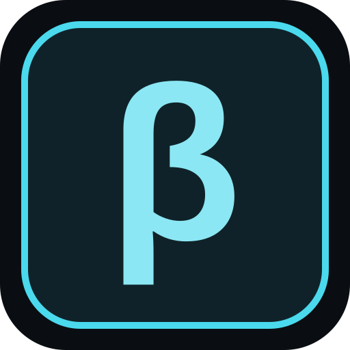

# Beta Mods

Beta Mods is a place to test game mods before release. Authors share builds, testers report bugs, and readiness votes show how each version is doing.

The [hosted site](https://betamods.com) is in a small private beta. This repository contains the application, artwork, tests, and deployment tools. Anyone can read the source, open an issue, fork it, and submit a pull request. User data, uploads, credentials, and backups are not part of the public repository.

## What works today

- Mod listings, versioned builds, scanned screenshot galleries, requirements, and a searchable catalog.
- Email and password accounts, verification, recovery, profiles, following, and notifications.
- Bug reports and readiness votes for each build, with private report attachments.
- Author dashboards, moderation tools, and upload approvals and quotas for the pilot.
- A downloadable Nexus release package containing the latest scanned build, scanned gallery media, a BBCode description, summary, readme, changelog, and requirements checklist.

Authors review the release package and publish on Nexus themselves. The requirements file is a checklist for Nexus's search-and-link interface, not text to paste into a requirements field.

Per-mod download codes, unlisted betas, and individual tester invitations are not built yet. The current access code covers the whole site. Nexus sign-in and API integration are unfinished; the beta uses email and password accounts. Beta Mods is independent of Nexus Mods.

## Technology

The app uses Next.js 16, React 19, TypeScript, Tailwind CSS 4, Drizzle ORM, and PostgreSQL. Development uses Node.js 22, pinned in `.nvmrc`, and the committed npm lockfile. If you use nvm, run `nvm use` before installing dependencies.

The current hosted pilot uses Render for the app, Neon for PostgreSQL, a private Supabase S3 bucket for files, Transloadit for malware scanning, and Resend for account emails. Contributors do not need accounts with those services to work on the UI or run the default checks.

Local development can use PostgreSQL, local file storage, and ClamAV without Docker or provider accounts. The older home and Oracle configurations remain in the repository but are not used by the live pilot.

## Start contributing locally

Fork the repository on GitHub, then clone your fork:

```sh
git clone <your-fork-url> betamods
cd betamods
git switch -c <your-change-branch>
npm ci
npm run dev -- --hostname 127.0.0.1
```

Open <http://127.0.0.1:3000>. Without `DATABASE_URL`, you can work on the layout and empty states. Accounts, listings, and uploads need a database. Use your own development configuration, never the live pilot or a maintainer's environment files.

On Windows PowerShell, use `npm.cmd` if execution policy blocks `npm.ps1`.

Run the checks in a fresh checkout with no private environment files or inherited service credentials:

```sh
node node_modules/next/dist/bin/next typegen
npm run typecheck
npm run lint
npm test
npm run build
```

See [Contributing](CONTRIBUTING.md) for database and scanner setup. Integration and end-to-end tests can write data and run separately from contributor CI.

## Contributing

Bug reports, design feedback, documentation, and testing are welcome. Discuss larger changes in an issue or Discord before building them. Submit code through a fork, branch, and pull request. The owner reviews changes and approves contributor CI before it runs. Only the owner merges and deploys.

- [Contributing](CONTRIBUTING.md): setup, checks, and pull requests.
- [Governance](GOVERNANCE.md): how decisions and maintainer responsibilities work.
- [Security](SECURITY.md): how to report a vulnerability privately.
- [Architecture](docs/ARCHITECTURE.md): application structure and security boundaries.
- [Deployment](docs/DEPLOYMENT.md): configuration profiles and operator responsibilities.
- [Scripts](scripts/README.md): runtime entry points, local checks, and operator tools.
- [Product spec](beta-mod-hub-spec.md): the original design, including work that is still planned.

## Security and file ownership

Files stay in quarantine until they pass scanning. Failed or missing scans must block publication. Changes must preserve that behavior, permission checks, private storage, and quota accounting.

Never attach real credentials, access codes, user exports, private mod archives, or live signed download URLs to an Issue or pull request. Use small synthetic fixtures that you have permission to share.

## Source permissions

No open-source license has been selected. Viewing, opening Issues, forking, and submitting pull requests on GitHub are welcome. Public visibility is not a general open-source license; ask the owner about other uses until a license is chosen. Uploaded mods, artwork from third parties, and dependencies keep their existing rights and licenses.
